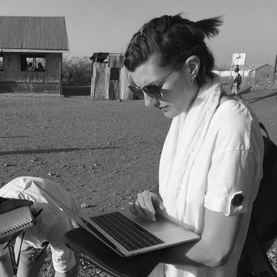

Necoline has spent her career connecting people to tools that closely match their needs. Over the years, she has channeled her passion for helping people through building web tools and leading engineering teams. She has recently been delightfully absorbed in product development as she maps out the needs of scientific and technical users to plan and implement tools that help users better understand our world.